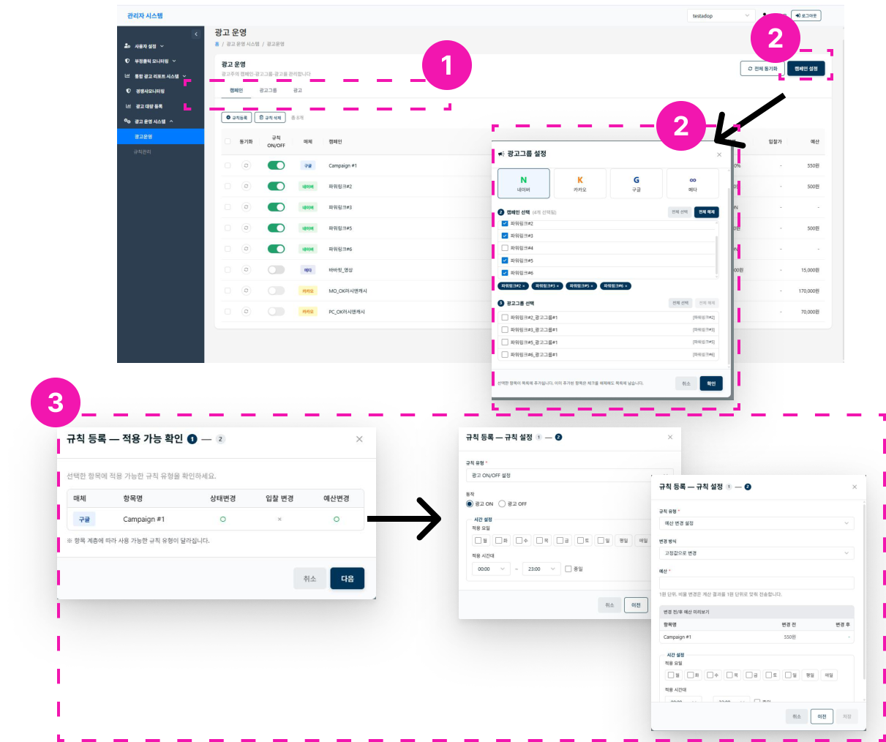

# 광고 운영

1. **광고 운영 탭** - 캠페인/광고그룹/광고 운영 현황 리스트를 확인하고, 각 광고 단위별 규칙 적용을 확인할 수 있습니다.
2. **설정** - 캠페인/광고그룹/광고 목록을 불러올 수 있습니다.
3. **규칙등록** - 매체별, 광고단위별로 규칙 적용이 가능한지 확인한 뒤 규칙을 설정할 수 있습니다.

## 설정할 수 있는 규칙

- 광고 on/off
- 입찰가 변경
- 예산 변경 (고정값 증감, 비율 증감 가능)
- 스케쥴 설정

!!! warning
    시스템 내부 자동입찰을 사용 중인 계정은 입찰가 변경 규칙을 설정할 수 없습니다.
