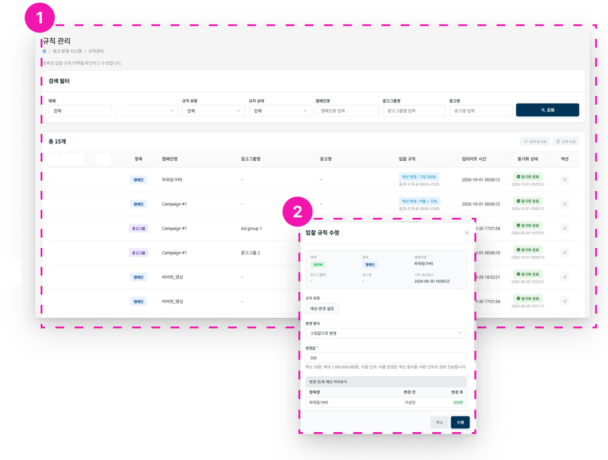

# 규칙 관리

## 1. 규칙 목록 확인

매체, 항목, 규칙, 규칙상태 등으로 규칙을 조회할 수 있습니다.

## 2. 규칙 수정

설정되어 있는 규칙을 수정할 수 있습니다.

!!! warning "수정 후 동기화"
    규칙을 수정한 후에는 반드시 동기화가 필요합니다. 운영 스케줄 설정은 매시간 자동으로 적용되지만, 동기화 상태가 **[미동기화]**이면 **[액션]** 버튼을 클릭해 수동으로 적용해야 합니다.
