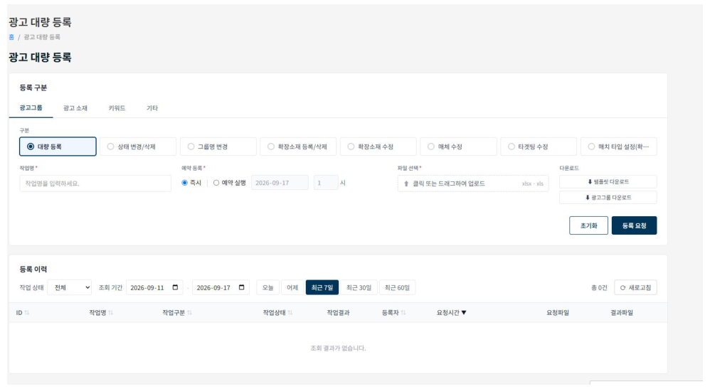
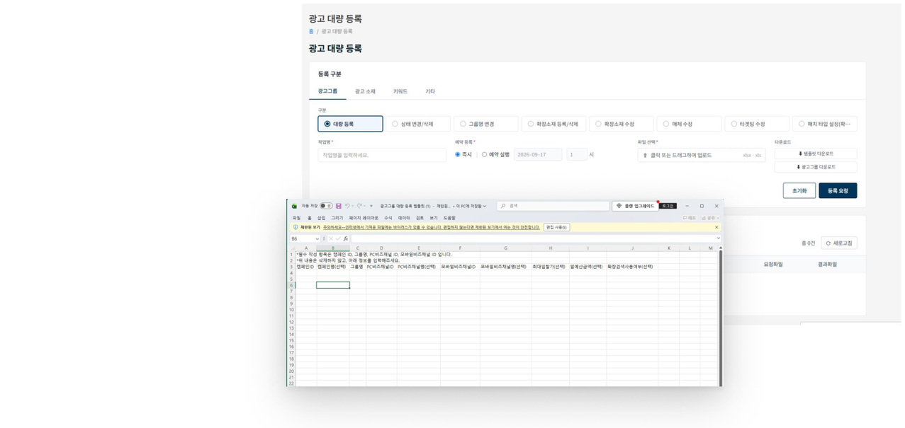

# 광고 대량 등록

!!! info
    광고 대량 등록은 네이버만 지원합니다.

## 1. 등록 구분

**광고 그룹, 광고 소재, 키워드, 기타** 탭으로 구분됩니다. 탭을 선택하면 해당하는 그룹별 구분 버튼이 활성화됩니다.

| 탭 | 구분 |
|------|------|
| 광고그룹 | 대량등록, 상태변경/삭제, 그룹명 변경, 확장소재 등록/삭제/수정, 매체수정, 타겟팅 수정, 매치타입 설정(확장/일치) |
| 광고소재 | 대량등록, 대량수정, 대량상태변경, 반응형소재 대량등록 |
| 키워드 | 대량 등록/수정, 대량 삭제, 입찰가/URL/ON OFF |
| 기타 | 확장소재 스케쥴 변경, 캠페인 예산 ON/OFF ,중복키워드 리스트 다운로드, 키워드 품질지수 다운로드|

## 2. 템플릿 다운로드 (예시 작업 등록) 

1. 탭 클릭후 [구분] 탭에서 작업을 선택
2. 하단 다운로드 섹션에서 템플릿 다운로드 후, 작성
3. 파일 선택에서 작성된 템플릿 업로드 후 작업명 설정
4. 등록요청 ( 예약 등록시 예약실행 일/ 시간 선택 후 등록요청)

템플릿은 구분별로 다르므로, 반드시 **[구분]을 선택한 후** 실행하려는 템플릿을 다운로드하세요.

구분별로 현재 목록을 내려받을 수도 있습니다.

- 광고그룹 다운로드 / 광고소재 다운로드 / 키워드 다운로드
- 중복 키워드 다운로드 / 확장소재 다운로드
- 키워드 품질지수 다운로드 / 캠페인 예산 ON·OFF 다운로드

예시: 광고그룹 대량등록은 템플릿을 다운로드한 후, 해당 광고 그룹 정보를 엑셀 템플릿 파일에 입력합니다.

## 3. 작업명 입력 및 예약 등록

예약은 시간 단위로 가능하며, 선택한 날짜에 자동으로 업데이트됩니다.

## 4. 등록이력 확인

등록에 실패하면 결과를 확인할 수 있습니다.
