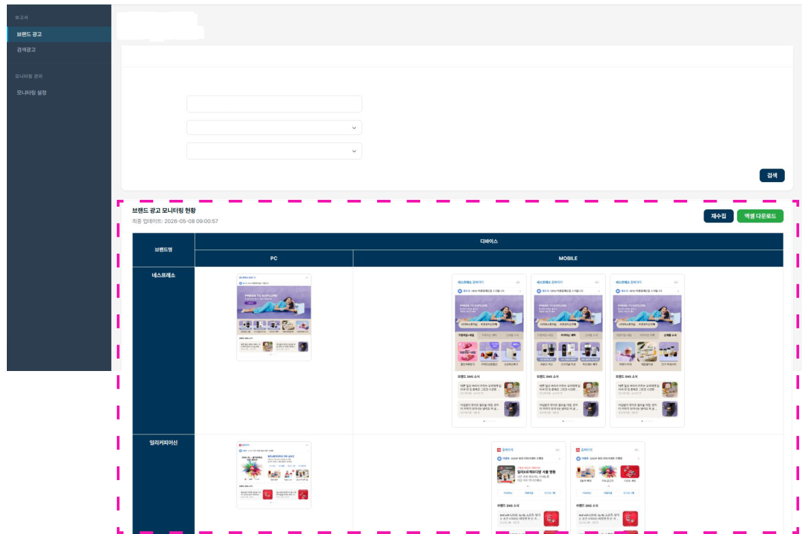

# 브랜드 광고 모니터링

## 검색필터

- 수집기간을 월간으로 설정했다면 월간 데이터만 조회할 수 있습니다.
- 수집기간을 주간으로 설정했다면 주간 데이터만 조회할 수 있습니다.

## 브랜드 모니터링 현황 확인

사용자가 설정한 시간에 수집된 네이버 브랜드 소재를 확인할 수 있습니다. 소재를 클릭하면 개별 확인과 다운로드가 가능하며, 브랜드별 소재를 엑셀 형태로 다운로드할 수 있습니다.

UI 기능은 [키워드 광고 모니터링](keyword.md)과 동일합니다.
