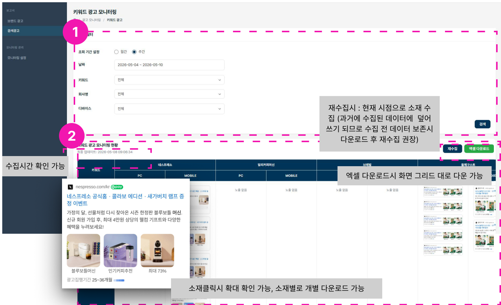

# 키워드 광고 모니터링

## 1. 검색필터

- 수집기간을 월간으로 설정했다면 월간 데이터만 조회할 수 있습니다.
- 수집기간을 주간으로 설정했다면 주간 데이터만 조회할 수 있습니다.

## 2. 모니터링 현황 확인

사용자가 설정한 시간에 수집된 네이버 SA 소재를 확인할 수 있습니다. 소재를 클릭하면 개별 확인과 다운로드가 가능하며, 키워드별 소재를 엑셀 형태로 다운로드할 수 있습니다.

- 수집시간을 확인할 수 있습니다.
- 소재를 클릭하면 확대해서 볼 수 있고, 소재별로 개별 다운로드할 수 있습니다.
- 엑셀 다운로드는 화면 그리드대로 다운로드됩니다.

!!! warning "재수집 시 주의"
    재수집하면 현재 시점으로 소재를 수집하며, 과거에 수집된 데이터에 덮어쓰기 됩니다. 수집 전 데이터를 보존하려면 다운로드한 후 재수집하세요.
