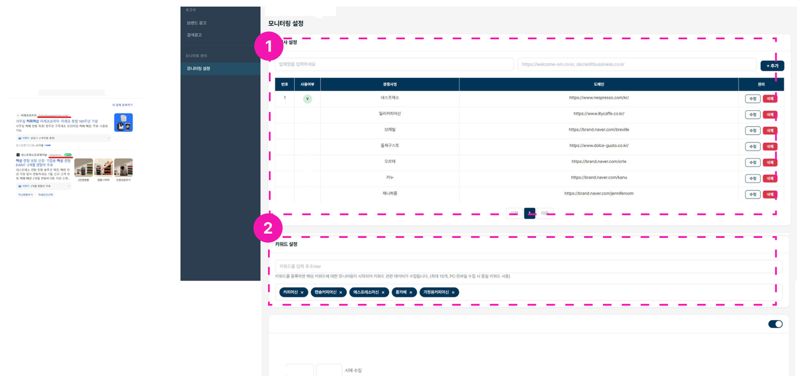
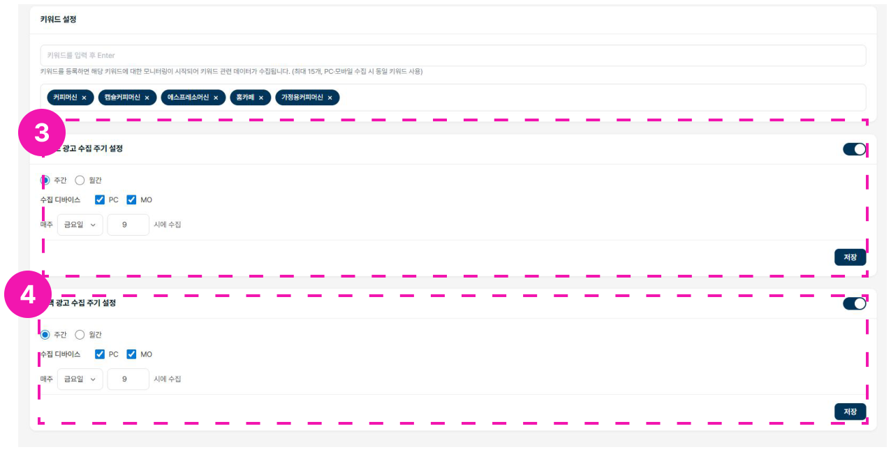

# 모니터링 설정

## 1. 경쟁사명 및 도메인 입력

경쟁사명과 도메인을 입력합니다.

!!! warning
    도메인은 반드시 해당 경쟁사의 광고 링크 도메인을 확인한 후 입력하세요. PC/모바일 링크가 다를 경우 모두 입력해야 합니다.

## 2. 키워드 설정

모니터링할 키워드를 입력합니다. 키워드를 반드시 입력해야 검색광고 모니터링이 가능합니다.

- 키워드는 최대 15개까지 입력할 수 있습니다.
- PC/MO 수집 시 동일한 키워드를 사용합니다.

## 3~4. 수집 주기 설정

3. **브랜드 광고 수집 주기** 설정
4. **검색광고 수집 주기** 설정

수집 주기는 주간/월간으로 설정할 수 있고, 수집 디바이스는 PC, MO를 선택할 수 있습니다.

| 수집 주기 | 수집 시점 |
|------|------|
| 주간 | 주 1회, 사용자가 선택한 요일·시간대 |
| 월간 | 월 1회, 사용자가 선택한 날짜·시간대 |
