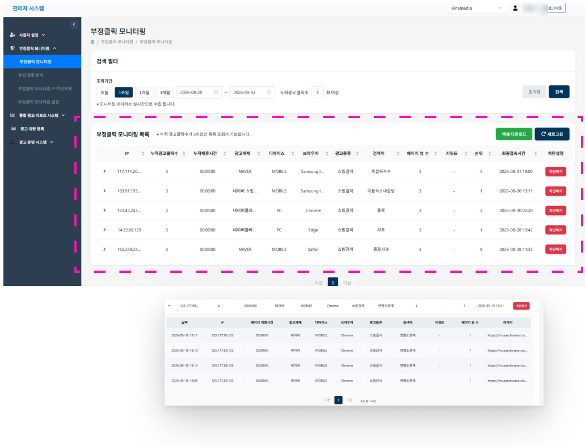

# 모니터링 항목

| 항목 | 설명 |
|------|------|
| IP | 광고클릭으로 들어온 IP |
| 누적광고클릭수 | 동일 IP가 동일 광고매체, 디바이스, 브라우저, 광고종류, 검색어(또는 키워드)로 들어온 누적 수 |
| 누적체류시간 | 동일 IP가 동일 광고매체, 디바이스, 브라우저, 광고종류, 검색어(또는 키워드)로 들어와 페이지에 체류한 누적 시간 |
| 광고매체 | 광고클릭이 발생한 매체 |
| 디바이스 | 광고클릭이 발생한 기기 |
| 브라우저 | 광고클릭이 발생한 브라우저 |
| 광고종류 | 광고클릭이 발생한 광고 종류 (쇼핑검색, 파워링크, 파워콘텐츠 등) |
| 검색어 | 광고클릭이 발생한 검색어 (쇼핑검색만 해당) |
| 키워드 | 광고클릭이 발생한 검색어 (파워링크만 해당) |
| 페이지뷰 수 | 동일 IP가 동일 광고매체, 디바이스, 브라우저, 광고종류, 검색어(또는 키워드)로 들어와 살펴본 페이지의 수 |
| 순위 | 광고클릭이 발생한 광고의 순위 |
