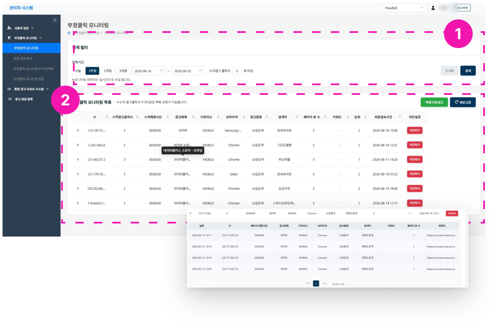

# 모니터링

1. 검색 필터로 최대 3개월의 모니터링 목록을 조회할 수 있습니다.
    - 기본 조회기간: 오늘, 누적광고 클릭수 3회 이상
    - 클릭수 필터 : 클릭수는 default 로 3회 이상으로 설정되어 있습니다. 조회를 원하는 클릭수로 변경 후 조회가능합니다.
2. 목록
    1. 스크립트 작동 이후 실시간으로 트래픽을 감지할 수 있습니다.
    2. 동일 IP의 누적광고 클릭수가 N회 이상인 기록을 조회할 수 있습니다.(필터 설정) 
    3. **차단하기** 버튼으로 부정클릭 IP를 차단할 수 있습니다. (현재 네이버 광고만 가능)
    4. 엑셀 다운로드 기능이 있습니다. 다운로드는 화면에 보이는 내용 기준으로 됩니다. *예시: 클릭 N회이상의 ip 목록을 다운로드 하고 싶은 경우, 필터로 조회 설정 후 > 다운로드 
