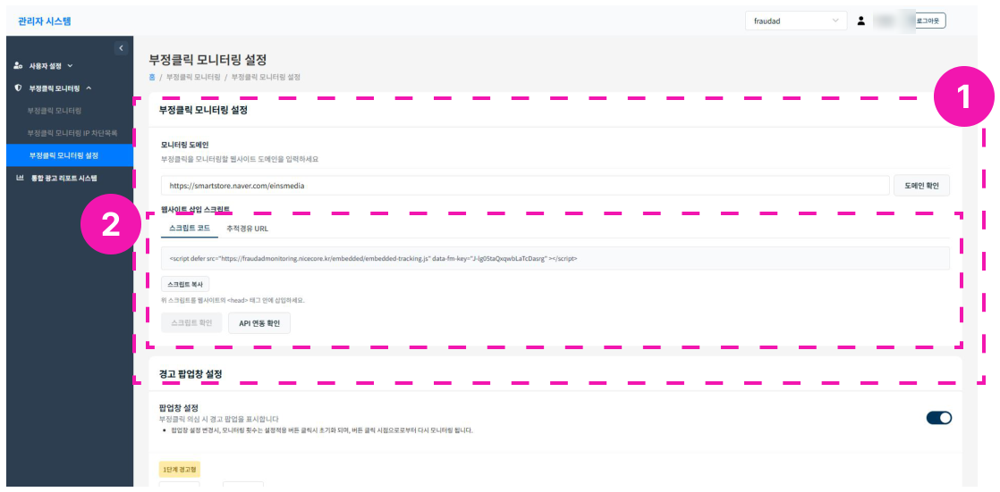
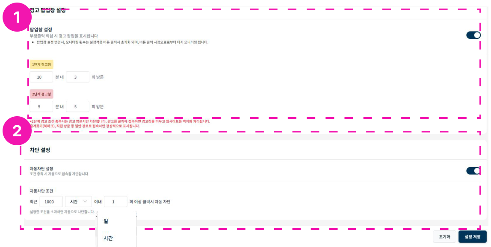

# 부정클릭 모니터링 설정

## 모니터링 설정

**step 1.** 부정클릭 모니터링에 이용할 도메인을 입력한 뒤, 올바른 도메인인지 확인합니다.

**step 2.** 웹사이트 삽입 스크립트를 복사해 웹페이지에 입력합니다.

:   스마트스토어의 경우, 추적경유 URL을 복사해 광고 캠페인에 설정합니다.

**step 3.** 웹사이트에 스크립트를 삽입한 뒤 **스크립트확인**을 클릭해 정상 작동 여부를 확인합니다.

**step 4.** **API연동확인**을 클릭해 네이버 SA IP 차단 기능 연동을 확인합니다.

:   최초 API 연동은 관리자 페이지에서 마케터가 직접 키를 입력합니다.

## 경고 팝업창 설정

**step 1.** 팝업창 설정을 on/off 합니다. 경고 팝업 임계치를 확인할 수 있습니다.

**step 2.** 경고창 단계를 설정합니다.

- 1단계 경고창: 동일 IP로 00분 내 00번 방문시 1단계 경고
- 2단계 경고창: 1단계 이후, 00분 내 00번 방문시 2단계 경고창 발생

**step 3.** 차단을 설정합니다. 차단 임계치를 설정해 접속 IP를 자동으로 차단할 수 있습니다. (현재 네이버만 지원)

:   자동 차단 조건: 00시간/일 내 N회 이상 클릭시 차단

**step 4.** **설정 저장**을 반드시 클릭해 저장합니다.
