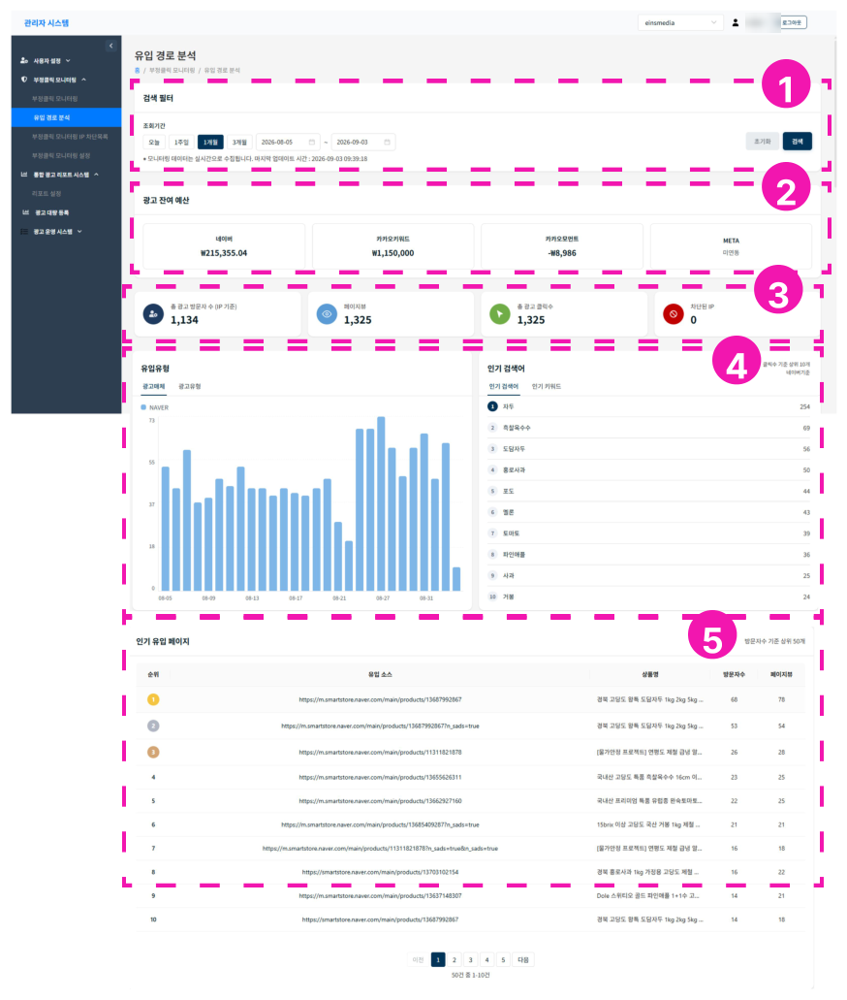

# 유입경로 분석

1. **검색필터** - 데이터 기간을 조회할 수 있으며, 최대 3개월까지 가능합니다.
2. **광고잔여예산** - 네이버, 카카오 키워드, 카카오모먼트, 메타 매체의 광고 잔여 예산을 확인할 수 있습니다.
    - [API 연동](../user-settings/api-integration.md)을 미리 해두어야 합니다.
3. **대시보드 section 1** - 기간별 summary: 총 광고 클릭 방문자수, 페이지뷰, 광고 클릭수, 차단된 IP(네이버 기준)
4. **대시보드 section 2** - 기간별 유입 유형 및 인기검색어
    - 유입유형: 기간별 매체별 유입 / 광고 유형별(예: 쇼핑검색, 파워링크 등) 유형
    - 인기검색어/인기 키워드: 기간별 광고 클릭 인기검색어 상위 10개 확인 (네이버만 지원)
5. **인기 유입페이지** - 인기 유입 상품을 확인할 수 있습니다. (네이버 쇼핑광고 지원)
