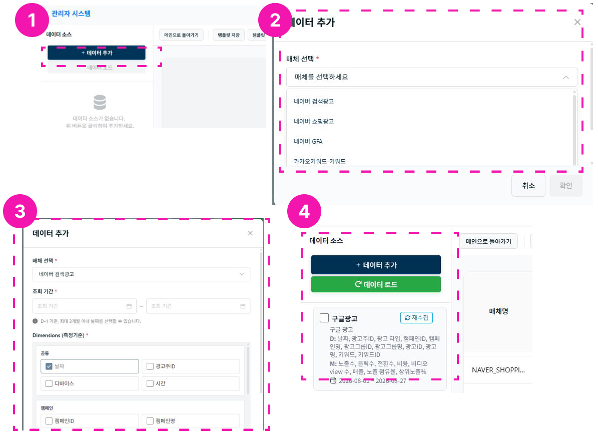

# 데이터 추가하기

1. 왼쪽의 **데이터 추가**를 선택합니다.
2. **매체 선택** - 데이터를 불러올 광고 매체를 선택합니다.
    - 현재 지원: 네이버(검색, 쇼핑), 네이버 GFA, 카카오(키워드, 모먼트), 구글, 메타
3. **조회 기준 및 측정 기준, 지표 설정**
    - 조회 기간은 D-1일부터 최대 3개월 이내로 선택할 수 있습니다.
    - 기간에 따라 조회 시간이 소요됩니다. (최대 약 30분)
    - 측정 기준은 매체별로 다르므로 [지표 설명]을 참고하세요.
    - 데이터 소스명을 지정한 후 **확인**을 클릭합니다.
4. **데이터 카드 클릭 후 데이터 로드**
    - 체크박스를 여러 개 선택한 뒤 데이터를 로드하면 선택한 데이터를 한번에 확인할 수 있습니다.
    - 특정 매체를 제외하려면 체크박스를 해제한 뒤 다시 **데이터 로드**를 클릭하세요.
    - **재수집** 버튼을 클릭하면 매체 데이터를 다시 수집할 수 있습니다.
