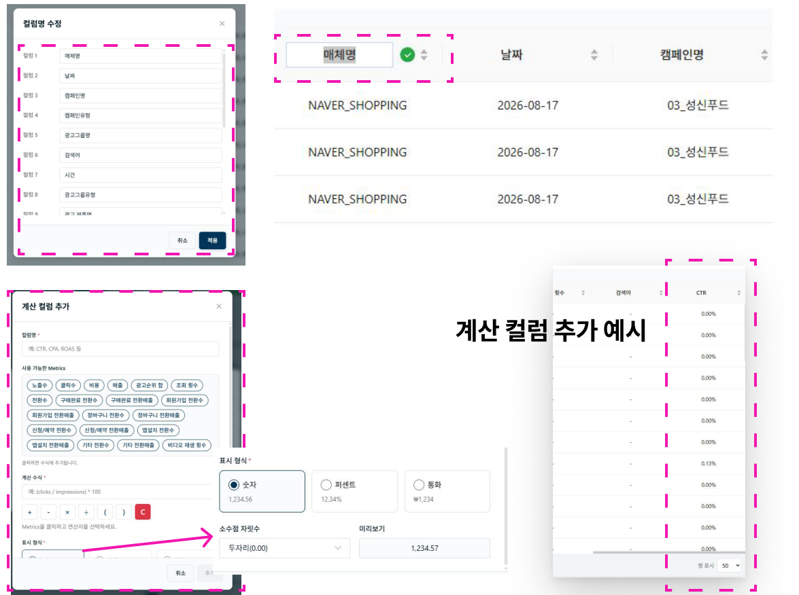
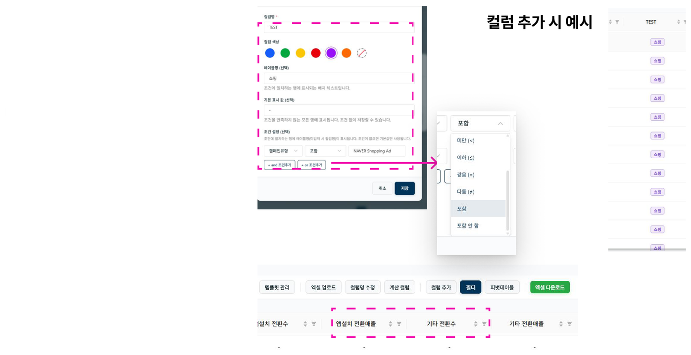

# 컬럼 관리

## 컬럼명 수정

상단 툴바의 **컬럼명 수정** 버튼을 누르거나, 매체 데이터 테이블에서 컬럼명을 클릭해 변경할 수 있습니다.

## 계산 컬럼 추가

CPC, CTR 등 커스텀 계산 컬럼을 추가할 수 있습니다.

- **사용가능한 METRICS**: 사용자가 매체 데이터로 불러온 METRICS만 선택할 수 있습니다.
- **계산 수식**: 사칙연산으로 설정할 수 있습니다.
- **표시형식**: 숫자, 퍼센트, 통화 형식을 선택할 수 있습니다.

## 컬럼 추가

- **컬럼명**을 입력합니다.
- 컬럼에 표시될 **색상**을 선택합니다.
- **레이블 명**: 조건 설정시 일치하는 행에 표시되는 이름
- **기본 표시명**: 조건에 상관없이 모든 행에 표시되는 이름
- **조건 설정**: 측정 기준 및 지표 조건을 AND / OR 조건으로 설정할 수 있습니다.

## 필터 기능

필터 기능을 클릭하면 적용되고, 다시 클릭하면 해제됩니다.
