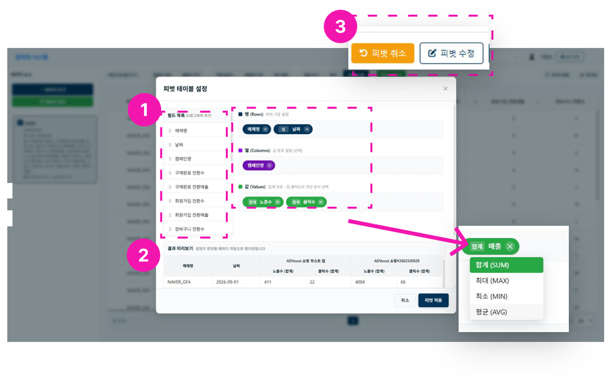

# 피벗테이블

1. **필드 목록 추가**
    - 선택한 필드 목록에서 각 필드를 행, 열, 값으로 드래그&드롭할 수 있습니다.
    - 값 필드에는 반드시 지표 필드만 넣을 수 있습니다. 칩을 클릭하면 합계, 평균, 최소, 최대 값으로 설정할 수 있습니다.
2. **결과 미리보기** - 피벗테이블 설정 결과를 미리 볼 수 있습니다.
3. **피벗 취소 및 피벗 수정** - 미리보기를 통해 피벗테이블 설정 결과를 미리 볼 수 있습니다.
