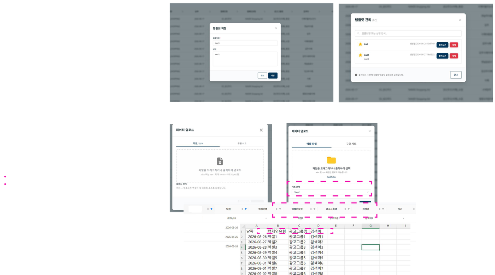

# 템플릿 저장 및 엑셀 업로드

## 템플릿 저장 및 관리

- **템플릿 저장**: 불러온 매체 데이터와 설정을 템플릿으로 저장할 수 있습니다.
- **템플릿 관리**: 저장된 템플릿 목록을 확인할 수 있습니다.

## 엑셀 업로드

- 엑셀: xlsx 파일 또는 CSV를 지원합니다.
- 구글 시트: 주소를 입력하며, 모두 공개된 시트만 가능합니다.
- 시트가 여러 개이면 시트 1개를 선택한 후 업로드할 수 있습니다.

!!! warning "컬럼명을 맞춰주세요"
    엑셀 시트와 매체별 컬럼 및 컬럼명을 통일해야 화면에서 매핑이 됩니다.
    예: 매체 데이터에 날짜, 광고그룹명, 검색어가 있다면 엑셀 데이터의 컬럼명도 날짜, 광고그룹명, 검색어여야 데이터가 통합됩니다. 컬럼명이 다르면 신규 컬럼으로 생성됩니다.
