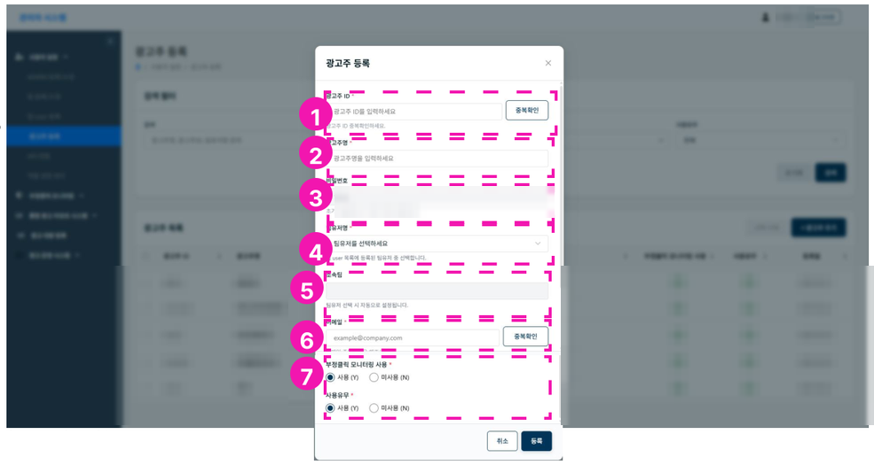

# 광고주 등록/수정

광고주 등록은 팀 admin / 팀원 계정이 추가할 수 있습니다.

1. 광고주 ID 입력, 중복확인
2. 광고주명 입력
3. 비밀번호 - 초기 비밀번호가 자동으로 설정됩니다. 사용자가 직접 로그인한 후 비밀번호를 변경할 수 있습니다.
4. 담당 AE 선택 (팀원명 선택)
5. 소속팀 - 담당 AE 선택시 자동 선택
6. 이메일 입력
7. 사용유무 - Y/N
    - 피이관 등 사용 중지 계정일 경우 N
    - 부정클릭모니터링 사용유무 - Y/N (Y시 부정클릭모니터링 광고주 접근 가능)
