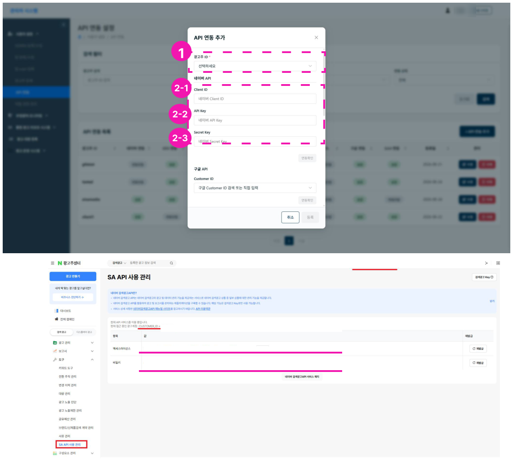
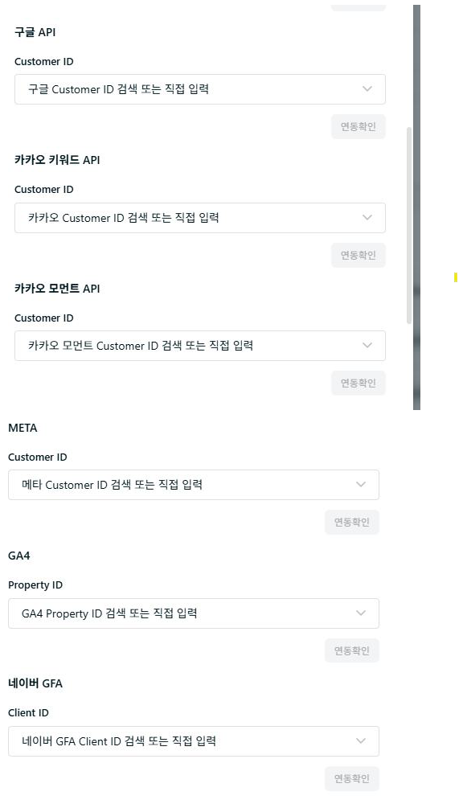
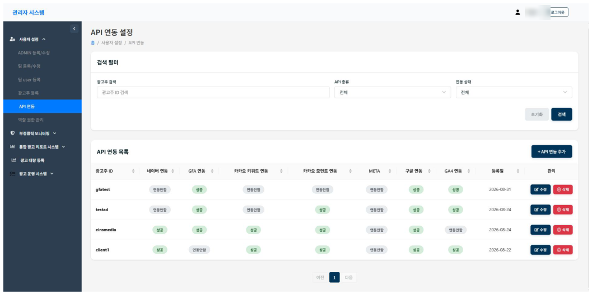

# API 연동

광고주별로 매체 계정을 연동합니다. 매체 데이터를 사용하는 기능(리포트, 광고 잔여 예산 확인, IP 차단 등)을 쓰기 전에 먼저 연동해 주세요.

## 네이버 API 연동

1. **광고주 선택** - API 연동할 광고주 ID를 선택합니다.
2. **네이버 API 키 입력** - 네이버 광고주센터에 접속해 아래 순서로 값을 확인한 뒤 시스템에 입력합니다.
    1. 도구 > SA API 사용 관리로 이동합니다.
    2. customer id를 시스템의 **Client ID**(2-1)에 입력합니다.
    3. 엑세스 라이선스를 시스템의 **API Key**(2-2)에 복사/붙여넣기 합니다.
    4. 비밀키를 시스템의 **Secret Key**(2-3)에 복사/붙여넣기 합니다.

## 기타 매체 API 연동

구글, 카카오, 메타, GA4 계정은 customer id로 검색하거나 리스트에서 클릭해 선택할 수 있습니다.

!!! warning "꼭 확인하세요"
    - 네이버 GFA는 반드시 customer id를 끝까지 입력하세요.
    - API 연동 시 client id를 입력한 후 **[연동확인]**을 반드시 클릭해 연동을 확인해야 합니다.

## 연동 상태 확인

광고주 ID별 연동 상태를 확인할 수 있습니다. 연동에 실패하면 **수정** 버튼을 눌러 값을 고치고, 계속 실패하면 문의를 요청하세요.

