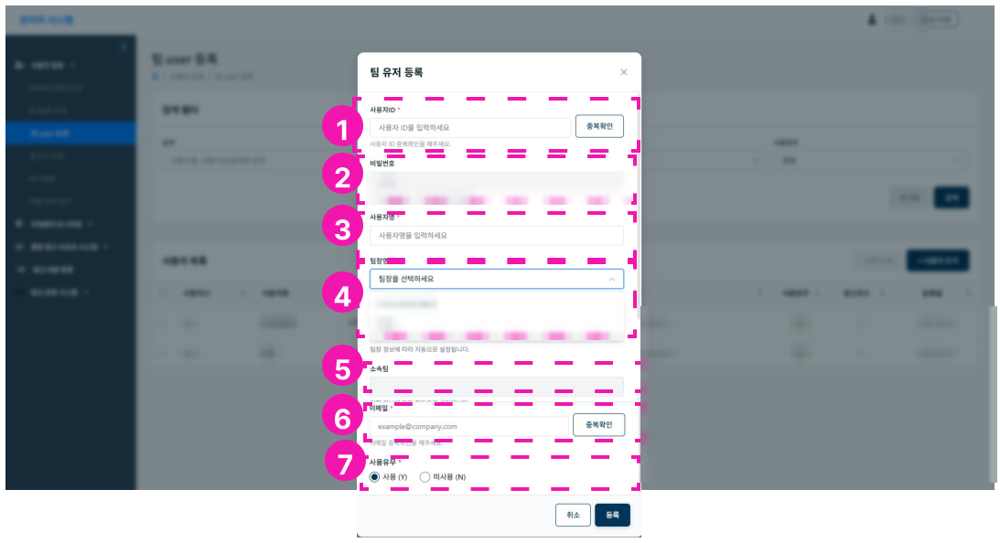

# 팀 유저 등록/수정

팀 유저는 팀 admin이 하위 계정으로 추가할 수 있습니다.

1. 팀유저 사용자 ID 입력, 중복확인
2. 비밀번호 - 초기 비밀번호가 자동으로 설정됩니다. 사용자가 직접 로그인한 후 비밀번호를 변경할 수 있습니다.
3. 사용자명 입력 (팀원명)
4. 팀장명 선택
5. 소속팀 - 팀장 선택시 자동 선택
6. 이메일 입력
7. 사용유무 - Y/N

!!! tip
    초기 비밀번호는 관리자에게 문의하세요.
